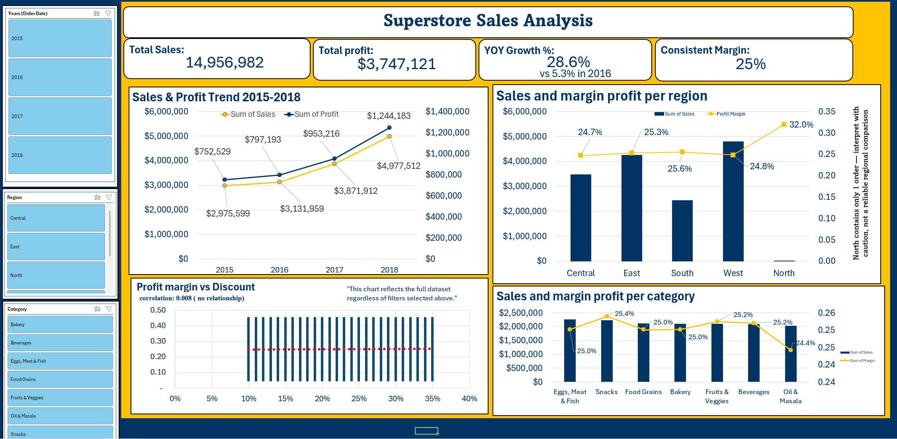

# Superstore Sales Analysis — Excel Data Analytics Project

An end-to-end Excel data analysis project: cleaning a real-world messy dataset, answering four business questions with pivot tables, and building an interactive dashboard with slicers.

**[View the dashboard](Superstore_project.xlsx)** · Built entirely in Microsoft Excel — no external tools.

---

## Business Problem

A Tamil Nadu–based grocery retail chain operates across 5 regions, 24 cities, and 7 product categories (23 sub-categories). Leadership wants to know:

- Where should we focus expansion and marketing investment?
- Which product categories actually drive profit, versus just revenue?
- Is discounting helping or hurting margin?
- How has performance changed 2015–2018, and where is the business headed?

## Dataset

- **Source:** [Supermart Grocery Sales – Retail Analytics Dataset](https://www.kaggle.com/datasets/mohamedharris/supermart-grocery-sales-retail-analytics-dataset) (Kaggle)
- **Size:** 9,994 orders, 2015–2018
- **Fields:** Order ID, Customer, Category, Sub-Category, City, Region, Order Date, Sales, Discount, Profit

## Data Cleaning

The raw data looked clean at first glance, but had one real, non-obvious issue: **`Order Date` was stored in two different formats mixed in the same column** — `DD-MM-YYYY` and `M/D/YYYY`.

- Detected the two formats by checking for `-` vs `/` in each cell
- **Proved** the slash-format dates were `M/D/YYYY`: every single row has a day value between 13–31 in the second position — a number that can never be a month, so it can only be the day
- The dash-format convention **could not be proven from the data alone** (both positions maxed out at 12). Rather than guess silently, this was documented as an assumption: `DD-MM-YYYY`, based on the dataset representing Indian customers (the regional convention), and disclosed as a limitation
- Rebuilt a single, reliable date column from the two formats using `DATE()`, verified against the original raw values before removing the mixed-format source column

Also found: the **`North` region contains only 1 order** out of 9,994. Rather than silently include or silently drop it, it's treated as a disclosed data limitation — included in category/time/discount analysis (where it doesn't skew anything), but excluded specifically from region-to-region comparisons, where a single order isn't a meaningful sample.

## Key Findings

**1. Regional performance** — Sales volume varies a lot by region (West: $4.8M → South: $2.4M), but profit margin barely moves (24.7%–25.6% across all regions). Regions differ in *how much* they sell, not in *how efficiently* they sell it.

**2. Category profitability** — Margins are flat across every category (24.4%–25.4%) — no standout winner or loser. A hypothesis that one region's margin edge came from strong performance in a specific sub-category was tested directly against a comparison region and **disproved** — the advantage turned out to be broader/mix-driven, not tied to any single product.

**3. Discount effectiveness** — Correlation between discount level and profit margin: **0.008** — essentially zero. Heavier discounting does not measurably erode margin in this dataset, tested via bucketed averages, a full scatter plot, and a correlation coefficient.

**4. Growth over time** — Year-over-year growth **accelerated** every year: 5.3% (2016) → 23.6% (2017) → 28.6% (2018). A historical Jan/Feb seasonal sales dip present in 2015–2017 **shrank sharply by 2018** (dip size relative to the yearly average fell from ~51% to ~19%) — most likely because strong overall growth is lifting even the historically weak months, not because seasonality disappeared.

**The unifying insight:** profit margin holds steady at ~25% across every region, category, discount level, and year tested. Growth is being driven entirely by increasing sales volume, not by improving efficiency, pricing, or discount strategy.

## Dashboard

An interactive, single-screen dashboard with:
- KPI cards: Total Sales, Total Profit, YoY Growth, and the "Consistent ~25% Margin" headline insight
- A dual-axis Sales & Profit trend chart (2015–2018)
- Combo charts (bars + margin line, dual axis) for Region and Category, so volume and margin differences are visible in the same view
- A Discount vs. Margin scatter chart with the correlation stat labeled directly on it
- Slicers for Year, Region, and Category, cross-filtering all charts at once

## Tools & Skills Demonstrated

Data cleaning (text-to-date parsing, mixed-format detection, duplicate/missing-value checks) · Pivot Tables & Pivot Charts · Calculated fields · `TEXTBEFORE`/`TEXTAFTER`/`VALUE`/`DATE` formulas · Conditional formatting · Data validation · Slicers & report connections · Combo/dual-axis charts · Correlation analysis

## Limitations & Assumptions

- Dash-format dates were assumed `DD-MM-YYYY` (regional convention) — not provable from the data itself
- `North` region (1 order) excluded from regional comparisons due to sample size, not because the data is invalid
- No cost data beyond Profit — margin *differences* can be measured, but not fully explained (e.g., supplier cost, logistics)
- Dataset shows no loss-making orders (Profit is never negative), which is a limitation of this synthetic dataset versus real-world retail data
